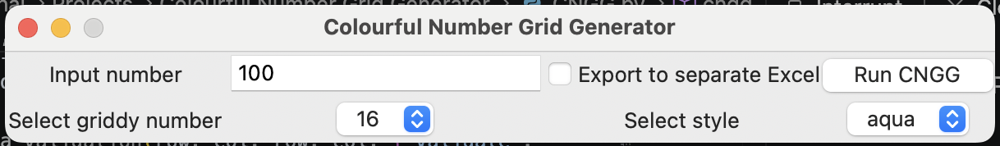

# Colourful Number Grid Generator
* **Project started**: Saturday, 05 September 2026
* **Project completed**: Wednesday, 09 September 2026
* **Project last updated**: Friday, 11 September 2026

## Background
A playful script to generate a grid of numbers starting from 1 to the number supplied to argument `inp` (default is 100), which is exported to Excel. Square numbers are highlighted in red, and numbers that cross the grid are coloured in orange, to produce a colourful grid that when zoomed out looks similar to the Union Jack flag.

### Working files
* **CNGG.py**: Script file
* **griddy.json**: List of input numbers that produce a clean grid with crossgrid highlight across rows and columns, without extra rows, described within the context of this project as "griddy". This is updated as new "griddy" inputs are used to produce a grid.
* **run.ps1**: Optional PowerShell script which calls the `gui()` function to open the Tkinter user interface, providing the ability to input a number to generate a grid with, and also being able to select "griddy" numbers from a drop-down menu.

### Python libraries used
#### Pre-installed:
---
* pathlib (for function `Path`)
* json
* tkinter (standalone and for `ttk`)
#### Dependencies (requiring installation if not already installed):
---
* xlsxwriter (to export to Excel)

## Functions/Classes

### `cngg`
```python
def cngg(inp:int = 100, ind:bool = False) -> list
```
#### Args

| Parameter | Type | Notes |
| --- | --- | --- |
| `inp` | Auto-completed | Set to 100 if left empty  |
| `ind` | Auto-completed | Set to False if left empty. If `True`, a separate Excel file is created for a grid, with the input number included in the file name|

### `gui`
```python
def gui() -> None
```

### User interface
While function `cngg` can be called by opening `script.py`, the user interface, accessible through function `gui` provides a "friendlier" alternative for interacting with the function to generate grids.



#### Interface guidance
| Row | Option | Type | Purpose |
|---| ---|---|---|
| Top | Input number | Input field | To enter the maximum number of the grid to generate. |
| Top | Export to separate Excel | Checkbox | Specifies whether a grid is exported as a separate Excel workbook if selected. If not selected, workbook `cngg.xlsx` is created or overwritten (where it already exists). |
| Top | Run CNGG | Button | Runs function `cngg` with the input number and value of the checkbox. |
| Bottom |Select griddy number | Dropdown | Displays the griddy numbers from `griddy.json` which can be selected to enter into the input number field. |
| Bottom | Select style | Dropdown | Only for styling the look of the user interface. Displays the Tkinter themes installed on the local machine that can be selected to change how the user interface looks.

    